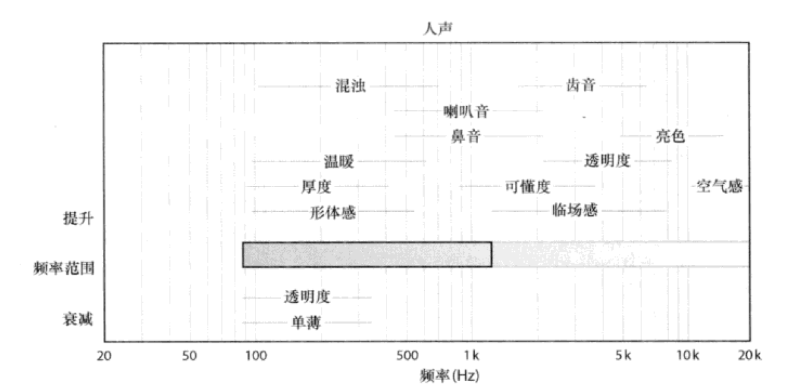

# EQ Basics: Ep.2

### EQ 基础：第二节

-----

## Do you know things already?

----

How sound sounds like in different frequency.

----

Why you need to enhance the sound.

----

The difference between Analog-Modeling EQ and Digital ( stock ) one.

-----

## Review

----

- EQ Curve & Filter Types
- The Science of Sound
- Q Value

-----

## Let's Turn Back -->

-----

This Sound Needs More OO

----

- For Enhancing, We usually use additive moves.
- When You thinks that the Sound Needs More OO, That Mains You should Boost the Frequency that Not Enough.
- Listen to it and Boost it. Then **Turn back to the whole mix**, **Check** it.

-----

## Maybe you need a Cheat sheet

----

《混音指南》 P246

----

But Again:

Your Ears First!

-----

Lab:

-----

## A easy way EQing Vocal

----

Why not give yourself some limitation?

for example: 

**using a just 3-band EQ**

----

Lab: Let me show you:

-----

## Why Analog EQ Better?

----

Wait! 

**Yes or No first, then ask why.**

先问是不是，再问为什么。

----

Lab:Some Example:

-----

Maybe another Lab:

-----

That's all!

-----

Reference:

- The Ultimate Guide to EQ / Slate Academy
- [PLEASE Stop Butchering your vocal EQ!](https://www.youtube.com/watch?v=2Gls252xwcc)

